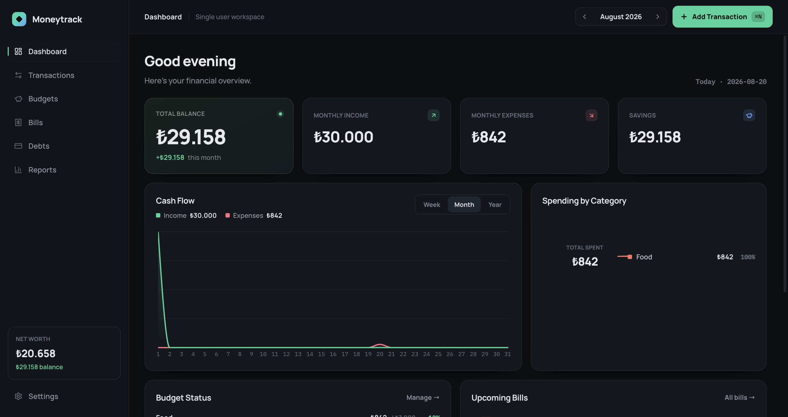
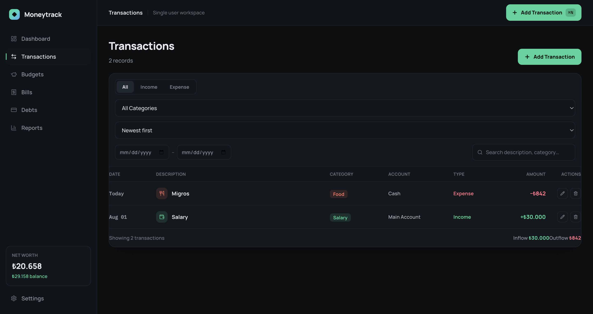
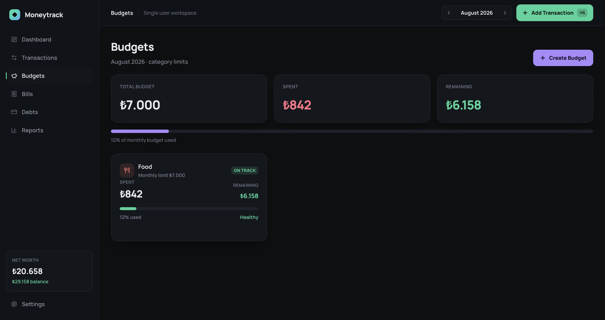
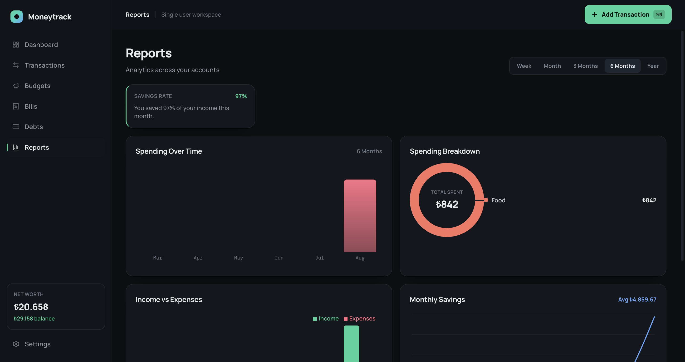

# Moneytrack

Moneytrack is a **local-first personal finance desktop application** for macOS and Windows.
Everything you enter — income, expenses, budgets, bills, debts — lives in a SQLite database on
your own machine. There is no account, no login, no cloud sync, and no network calls at runtime.

| Dashboard | Transactions |
|---|---|
|  |  |

| Budgets | Reports |
|---|---|
|  |  |

> Bills, Debts, and Settings screenshots aren't included yet — drop PNGs into
> `docs/screenshots/` (`bills.png`, `debts.png`, `settings.png`) and add them above the same way.

## Features

- **Transactions** — full CRUD, search, filter by type/category/date, sort, quick-add (`⌘/Ctrl+N`
  from anywhere in the app)
- **Dashboard** — total balance, monthly income/expenses/savings, savings rate, cash flow chart,
  spending by category, budget status, upcoming bills, recent transactions — all computed live
  from the database, nothing hard-coded
- **Budgets** — per-category monthly limits with spent/remaining/percentage and
  normal → warning → critical → exceeded states, browsed month by month
- **Bills** — one-off or recurring (weekly/monthly/yearly), automatic overdue detection, "mark
  paid" optionally records a matching expense transaction and rolls a recurring bill's due date
  forward automatically
- **Debts** — track original/remaining balance and monthly payment, record payments (never
  optional expense creation unless you ask for it), full payment history, automatic "Paid Off"
  state
- **Reports** — spending over time, income vs. expenses, spending breakdown, monthly savings,
  category comparison, across Week/Month/3 Months/6 Months/Year ranges
- **Local rule-based insights** — "You spent 18% more on Food compared with last month," etc.
  Computed from real data, no AI/network calls, and suppressed when there isn't enough history
  to say something meaningful
- **Settings** — currency, week start, date format, theme (dark/light/system), CSV/JSON export,
  JSON import (validated before anything is touched), SQLite backup, destructive reset behind a
  confirmation dialog

## Technology stack

| Layer | Choice |
|---|---|
| Shell | Electron |
| UI | React + TypeScript + Vite |
| Styling | Tailwind CSS |
| Database | SQLite via `better-sqlite3` |
| Charts | Recharts |
| Icons | Lucide React |
| Dates | date-fns |
| Packaging | electron-builder |
| Tests | Vitest |

## Project structure

```
Moneytrack/
├── electron/                 # Main process — the only code that touches Node/SQLite
│   ├── main.ts                # App lifecycle, window, menu, shortcuts
│   ├── preload.ts              # contextBridge surface exposed to the renderer as window.api
│   ├── database/
│   │   ├── database.ts         # Opens/creates the DB in the OS userData dir, runs migrations
│   │   ├── schema.ts           # Table DDL + default categories
│   │   ├── migrations.ts       # Ordered, transactional migration runner (pragma user_version)
│   │   ├── seed.ts             # Development-only demo data generator
│   │   └── repositories/       # One file per table/domain — all SQL lives here
│   ├── services/                # insightsEngine.ts, dataService.ts (export/backup/import/reset)
│   ├── ipc/handlers.ts          # Registers every IPC channel, validates input, wraps errors
│   └── utils/                   # logger.ts, validate.ts, windowState.ts
├── src/                       # Renderer — React. Never touches Node or SQLite directly.
│   ├── pages/                  # Dashboard, Transactions, Budgets, Bills, Debts, Reports, Settings
│   ├── features/                # Per-domain modals/logic (transactions/, budgets/, bills/, debts/)
│   ├── components/
│   │   ├── ui/                  # Button, Modal, Card, Field, ConfirmDialog, EmptyState, ...
│   │   ├── layout/               # Sidebar, TopBar
│   │   └── charts/                # Recharts wrappers styled to match the design
│   ├── context/AppContext.tsx    # Page routing, settings/categories cache, month selector,
│   │                              # global "Add Transaction" modal state, data-refresh signal
│   ├── hooks/                    # useApi (IPC query hook), useToast
│   └── utils/                    # money/date formatting, category icon lookup, report ranges
├── shared/                     # Imported by BOTH electron/ and src/ — the single source of
│   │                            # truth for types, IPC channel names, and pure financial math
│   ├── types.ts
│   ├── ipc-channels.ts
│   ├── money.ts                 # moneyToMinorUnits / minorUnitsToMoney / formatCurrency
│   └── calculations.ts          # budgetPercentage, savingsRate, applyDebtPayment, etc.
├── tests/                      # Vitest — pure calculation + money unit tests
├── design/                     # Original Claude Design reference (Moneytrack.dc.html) kept
│   │                            # for visual comparison — not part of the shipped app
├── build/                       # Icon sources: icon.icns (macOS), icon.ico (Windows), icon.png
└── .github/workflows/release.yml
```

**Architecture rule:** the renderer never imports `better-sqlite3` or any Node module. Every
database operation goes React → `window.api.*` (preload, via `contextBridge`) → `ipcMain.handle`
→ a repository function → SQLite. `contextIsolation: true` and `nodeIntegration: false` are set
on the `BrowserWindow` and are non-negotiable.

## Database

- File: `moneytrack.db` (plus its `-wal`/`-shm` files), created automatically on first launch
- Location: the OS's per-user application data directory (`app.getPath("userData")`) —
  **never** inside the installed app bundle:
  - macOS: `~/Library/Application Support/Moneytrack/moneytrack.db`
  - Windows: `%APPDATA%\Moneytrack\moneytrack.db`
- Schema is applied through a small ordered migration runner (`electron/database/migrations.ts`)
  keyed off SQLite's `user_version` pragma — safe to re-run, each migration is transactional
- All monetary columns are **integer minor units** (e.g. ₺125.50 is stored as `12550`) — see
  `shared/money.ts`. Nothing in the codebase does float arithmetic on money.
- Default categories (8 expense, 5 income) and default settings (`TRY`, dark theme, Monday week
  start, `DD.MM.YYYY`) are inserted once, only if the `categories`/`settings` tables are empty.

### Backup

Settings → Data → **Back Up** opens a native Save dialog and writes a consistent snapshot of the
live database (via `better-sqlite3`'s own `.backup()` API, safe under WAL) to
`moneytrack-backup-YYYY-MM-DD.db`.

### Export / Import

- **Export → CSV**: transactions only, human-readable.
- **Export → JSON**: a full snapshot (categories, transactions, budgets, bills, debts, debt
  payments, settings) — round-trippable.
- **Import**: choose a Moneytrack JSON export. The file is structurally validated *before*
  anything is touched; on any validation failure the existing database is left completely
  untouched. A valid import replaces all data inside a single SQLite transaction (atomic — a
  failure partway through rolls back automatically).

## Getting started

Requires Node.js 22 (LTS) and npm — `better-sqlite3`'s prebuilt binaries require Node ≥22, and
older versions will fall back to a from-source `node-gyp` compile that can fail without a full
native toolchain installed. (Electron's own installer uses `extract-zip`, which also has a known
incompatibility with very new/pre-release Node versions such as 24+; if `npm install` reports
`Electron failed to install correctly`, stick to Node 22 LTS rather than a newer major.)

```bash
git clone <this-repo>
cd Moneytrack
npm install
npm run dev
```

`npm install` also runs `electron-builder install-app-deps`, which rebuilds `better-sqlite3` for
your installed Electron version automatically — no manual `node-gyp` steps needed on a normal
Node.js LTS setup. (`better-sqlite3` ships prebuilt N-API binaries for macOS/Windows/Linux ×
x64/arm64, so most machines don't compile anything at all.)

`npm run dev` starts the Vite dev server and Electron together, with hot reload on the renderer.

### Commands

| Command | What it does |
|---|---|
| `npm run dev` | Start the app in development (Vite + Electron, hot reload) |
| `npm run build` | Type-check, build the renderer, compile the main process |
| `npm run typecheck` | `tsc --noEmit` for both the renderer and the Electron project |
| `npm run test` | Run the Vitest suite |
| `npm run dist` | Build + package for the current platform |
| `npm run dist:mac` | Build + package a macOS `.dmg` |
| `npm run dist:win` | Build + package a Windows NSIS installer (`.exe`) |

## Building installers

```bash
npm run dist:mac    # → release/Moneytrack-<version>-arm64.dmg and Moneytrack-<version>-x64.dmg
npm run dist:win     # → release/Moneytrack-Setup-<version>.exe
```

`dist:mac` builds separate DMGs for Apple Silicon (`arm64`) and Intel (`x64`) rather than a single
universal binary — `better-sqlite3`'s prebuilt binaries conflict with `@electron/universal`'s
merge step, and per-architecture installers are simpler and standard practice anyway (this is how
most Electron apps ship). Users pick the file matching their Mac.

`dist:mac` must be run on macOS; `dist:win` is easiest on Windows (or via the GitHub Actions
workflow below, which builds each platform on its native runner — electron-builder does not
reliably cross-build Windows installers from macOS or vice versa).

Icons are already in place: `build/icon.icns`, `build/icon.ico`, `build/icon.png` (and the
`build/icon.svg` source they were generated from). If you replace the branding, regenerate all
three from a single high-resolution source and keep the filenames the same — electron-builder
picks them up automatically via the `build.mac.icon` / `build.win.icon` config in `package.json`.

## GitHub Releases

Push a version tag and `.github/workflows/release.yml` takes it from there:

```bash
git tag v1.0.0
git push origin v1.0.0
```

This runs two parallel jobs — `macos-latest` builds the DMG, `windows-latest` builds the NSIS
installer — then a third job downloads both artifacts and publishes a GitHub Release for that tag
with `Moneytrack-1.0.0.dmg` and `Moneytrack-Setup-1.0.0.exe` attached.

## Security & privacy

- No analytics, trackers, advertising SDKs, or telemetry.
- No network calls at runtime — fonts are bundled locally specifically so the app never has to
  reach `fonts.googleapis.com` or any other host.
- No cloud sync. All financial data stays in the local SQLite file.
- Financial data is **never** written to `localStorage`/`sessionStorage` — SQLite is the single
  source of truth, reached only through the IPC bridge described above.
- Renderer runs with `contextIsolation: true`, `nodeIntegration: false`. It cannot `require()`
  anything, touch the filesystem, or spawn processes — only the curated methods on `window.api`
  are reachable, and every one of them validates its arguments in the main process before
  touching the database.
- File pickers (export/backup/import) go through Electron's native `dialog` module, invoked only
  from a handful of specific, argument-validated IPC handlers — the renderer cannot request an
  arbitrary file path.
- Unexpected errors are logged locally (`<userData>/logs/error.log`) with the error message and
  stack only — never transaction payloads or other financial content.

## Known signing / notarization limitations

Both installers are built **unsigned** in this repo (`CSC_IDENTITY_AUTO_DISCOVERY=false` on
macOS; no Authenticode certificate configured for Windows). That means:

- **macOS**: Gatekeeper will show an "unidentified developer" warning. Users can open it via
  right-click → Open, or `System Settings → Privacy & Security → Open Anyway`. To ship a signed,
  notarized build: obtain an Apple Developer ID, set `CSC_LINK`/`CSC_KEY_PASSWORD` (or use
  `notarize: true` with `APPLE_ID`/`APPLE_APP_SPECIFIC_PASSWORD`/`APPLE_TEAM_ID`) as GitHub
  Actions secrets, and remove the `CSC_IDENTITY_AUTO_DISCOVERY: false` override in the workflow.
  No structural changes to the app are required — electron-builder handles signing/notarization
  automatically once credentials are present.
- **Windows**: SmartScreen may warn on first run since the `.exe` isn't Authenticode-signed. To
  sign it later, acquire a code-signing certificate and configure electron-builder's `win.certificateFile`/`certificatePassword` (or Azure Trusted Signing) as CI secrets — again, no
  code changes needed.

No signing credentials, certificates, or secrets are committed to this repository, and none
should ever be.

## Development notes

- **Demo data**: Settings → Data → "Seed Demo Data" is visible only when the app is *not*
  packaged (`!app.isPackaged`), and the underlying IPC handler refuses to run in a packaged build
  as a second layer of protection. It fills the database with several months of realistic
  transactions, budgets, bills, and debts so charts/reports have something to show while
  developing.
- **First run**: on a completely empty database, the app seeds the default categories and
  settings, then opens straight to a Dashboard showing polished empty states — no signup, no
  onboarding flow.
- The `design/` folder holds the original Claude Design mockup (`Moneytrack.dc.html` +
  `support.js`) this app was built from — kept for reference, not part of the shipped app.
